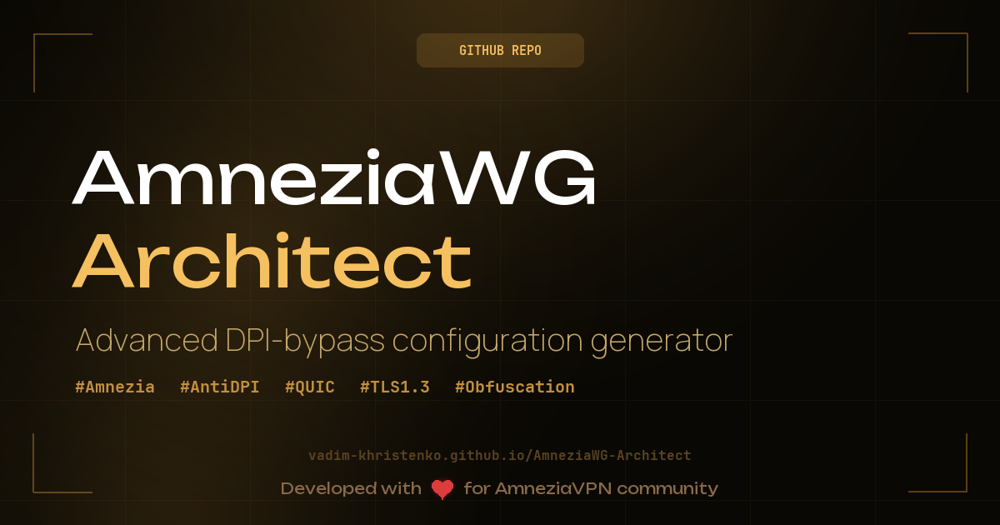
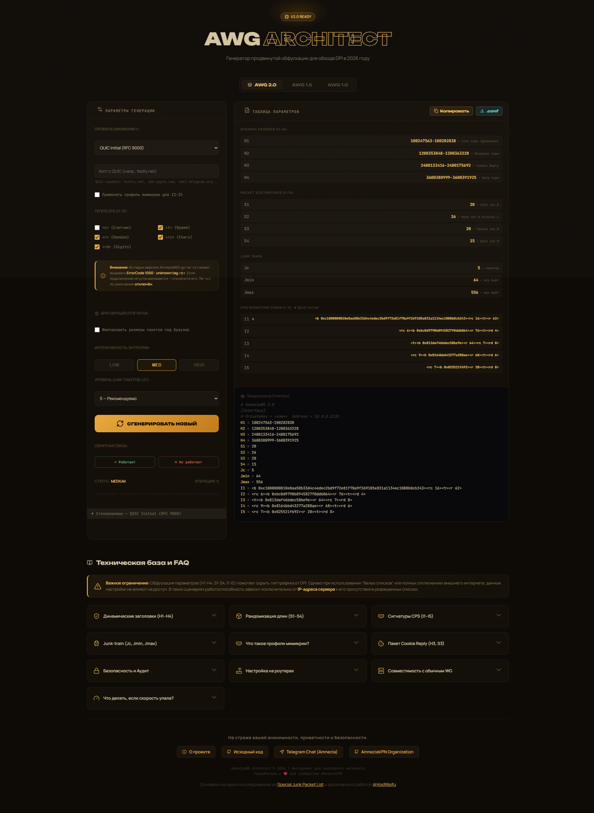
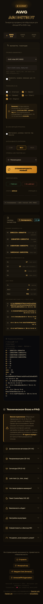

<div align="center">

# AmneziaWG Architect

[](https://github.com/Vadim-Khristenko/AmneziaWG-Architect/actions)
[](LICENSE)
[](https://github.com/Vadim-Khristenko/AmneziaWG-Architect/issues)
[](https://github.com/Vadim-Khristenko/AmneziaWG-Architect/stargazers)
[](https://github.com/Vadim-Khristenko/AmneziaWG-Architect/graphs/contributors)

**Веб-генератор CPS-конфигураций и профилей мимикрии для [AmneziaWG](https://github.com/amnezia-vpn/)**

[▶ Открыть генератор](https://vadim-khristenko.github.io/AmneziaWG-Architect/) · [📋 Issues](https://github.com/Vadim-Khristenko/AmneziaWG-Architect/issues) · [🤝 Contributing](#contributing)

*Основано на идее и доведено до ума [Special Junk Packet List](https://voidwaifu.github.io/Special-Junk-Packet-List/) от [@VoidWaifu](https://github.com/VoidWaifu), спасибо ему за вклад!*

</div>

---



## Интерфейс

<div align="center">
  <h3>Desktop Version</h3>
  
  
  <br/>
  
  <h3>Mobile Version</h3>
  
</div>

---

## Что это

**AmneziaWG Architect** — статический веб-инструмент для генерации параметров обфускации AmneziaWG: заголовков (H1–H4), размерных префиксов (S1–S4), junk-поездов (Jc/Jmin/Jmax) и цепочек CPS-сигнатур (I1–I5), имитирующих реальные протоколы (QUIC, TLS 1.3, HTTP/3, DTLS, SIP, WireGuard Noise_IK).

Работает **полностью в браузере** — никакие данные никуда не отправляются.

> **Важно:** инструмент генерирует *CPS-сигнатуры* (имитации заголовков), а не реальные стек-соединения. Это транспортный «силуэт» протокола — серверная поддержка не требуется.

---

## Поддерживаемые версии AmneziaWG

| Параметр | AWG 1.0 | AWG 1.5 | AWG 2.0 |
|---|:---:|:---:|:---:|
| H1–H4 (одно значение) | ✅ | ✅ | — |
| H1–H4 (диапазон) | — | — | ✅ |
| S1–S2 | ✅ | ✅ | ✅ |
| S3–S4 | — | — | ✅ |
| Jc / Jmin / Jmax | ✅ | ✅ | ✅ |
| I1–I5 (только клиент) | — | ✅ | ✅ |
| I1–I5 (сервер + клиент) | — | — | ✅ |

> **AWG 1.5:** I1–I5 настраиваются только на клиенте, сервер их не проверяет.  
> **AWG 2.0:** I1–I5 синхронизируются между клиентом и сервером.

---

## Быстрый старт

### Онлайн

Откройте [https://vadim-khristenko.github.io/AmneziaWG-Architect/](https://vadim-khristenko.github.io/AmneziaWG-Architect/)

### Локально

```sh
git clone https://github.com/Vadim-Khristenko/AmneziaWG-Architect.git
cd AmneziaWG-Architect

# Любой из вариантов:
python -m http.server 8000
npx http-server -c-1 .
```

Затем откройте `http://localhost:8000/`.

---

## Возможности генератора

- **Профиль мимикрии I1:** QUIC Initial · QUIC 0-RTT · TLS 1.3 · WireGuard Noise_IK · DTLS 1.3 · HTTP/3 · SIP REGISTER · Случайный
- **Пулы доменов** (~540 хостов) — каждый профиль использует собственный список доменов, проверенных на доступность в России в 2026 году
- **Свой домен:** поле `customHost` — задать конкретный хост для мимикрии вместо случайного из пула
- **Применять профиль для I2–I5** — при включении вся цепочка мимикрирует под один протокол; при выключении — I2–I5 генерируются как энтропийный шум
- **Интенсивность:** LOW / MED / HIGH — влияет на длины полей и сложность сигнатур
- **Junk-train:** выбор Jc (0–10 пакетов) и автоматический расчёт Jmin/Jmax
- **Адаптивная перегенерация:** кнопки «Работает / Не работает» усиливают параметры при каждой неудачной попытке
- **Экспорт:** копировать в буфер / скачать `.conf`-файл

---

## Структура проекта

```
AmneziaWG-Architect/
├── index.html                         # UI
├── style.css                          # Стили, адаптивность (mobile-first)
├── script.js                          # Логика генерации, hostPools, рендер
├── .github/
│   ├── workflows/
│   │   └── deploy-pages.yml           # CI/CD → GitHub Pages
│   └── ISSUE_TEMPLATE/                # Шаблоны для feedback по доменам
└── LICENSE
```

---

## Ограничения параметров

Генератор автоматически соблюдает следующие ограничения:

```
S4 ≤ 32                  # Data prefix не может превышать 32 байта
S1 + 56 ≠ S2             # Иначе Init и Response совпадут по длине после паддинга
H1, H2, H3, H4           # Диапазоны не должны пересекаться (v2.0)
```

---

## Домены и пулы (hostPools)

Списки хостов хранятся в `script.js` в переменной `hostPools` и разбиты на 5 пулов:

| Пул | Протокол | Хостов |
|---|---|:---:|
| `quic_initial` | QUIC Initial Packet (0xC0–0xC3) | ~138 |
| `quic_0rtt` | QUIC 0-RTT / Early Data (0xD0–0xD3) | ~54 |
| `tls_client_hello` | TLS 1.3 ClientHello | ~199 |
| `dtls` | DTLS 1.3 / WebRTC STUN-TURN | ~82 |
| `sip` | SIP REGISTER (UDP) | ~67 |

### Статус по регионам

Пулы актуальны для **России, Q1 2026**. Явно исключены:

| Сервис | Причина исключения |
|---|---|
| YouTube / Cloudflare | Заблокированы ТСПУ (2024) |
| Discord | Заблокирован (2024) |
| Facebook / Instagram / WhatsApp | Заблокированы (Meta — ЭО; WhatsApp — 11.02.2026) |
| Twitter / X | Деградация до полной недоступности |
| Telegram CDN (cdn1–5) | Троттлинг с 2025, полная блокировка ожидается 01.04.2026 |
| Google STUN (74.125.x.x) | IP-диапазоны пересекаются с блокировками YouTube |

Хотите предложить добавить или удалить домен — используйте [issue-шаблоны](.github/ISSUE_TEMPLATE/) открыв [issue](https://github.com/Vadim-Khristenko/AmneziaWG-Architect/issues/new).

---

## Безопасность

- Генератор работает **офлайн** — весь код выполняется в браузере, ничего не логируется
- CPS-сигнатуры — это только транспортный «силуэт» протокола, криптографический уровень WireGuard не затрагивается: Curve25519, ChaCha20-Poly1305, BLAKE2s остаются неизменными
- Выбор доменов для мимикрии — компромисс между реалистичностью и риском: предпочтительны домены CDN-инфраструктуры, обслуживающей банки и государственные сервисы (блокировка = экономический ущерб)
- Не добавляйте в пулы домены, которые вы не проверили на доступность в целевом регионе
- Соблюдайте законодательство страны, в которой используется инструмент

---

## Contributing

Мы рады внешним вкладчикам.

1. Форкните репозиторий и создайте ветку: `feature/your-change` или `fix/issue-123`
2. Внесите изменения; обновите `README.md` при необходимости
3. Откройте Pull Request с описанием: **что** меняется и **почему**

### Предложения по доменам

Для изменений в `hostPools` используйте issue-шаблоны:
- **Добавить домен** — укажите URL, профиль (quic_initial / dtls / …), регион и подтверждение доступности (curl / tracepath + дата)
- **Домен недоступен** — приложите краткий лог проверки (traceroute, curl -v, дата, ISP/регион)

Пул доменов поддерживается вручную и требует верификации перед добавлением.

---

## Лицензия

[MIT](LICENSE) — свободное использование, модификация и распространение.

---

<div align="center">

**AmneziaWG Architect** · [vadim-khristenko.github.io](https://vadim-khristenko.github.io/) · [AmneziaVPN Telegram](https://t.me/amnezia_vpn/) · [AmneziaVPN GitHub](https://github.com/amnezia-vpn/)

</div>
